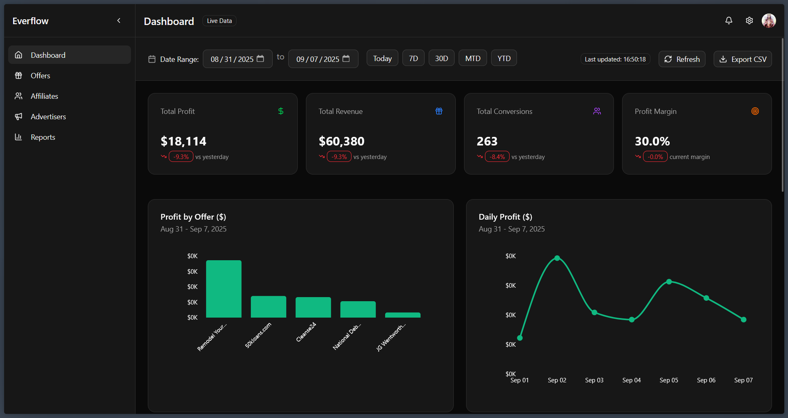
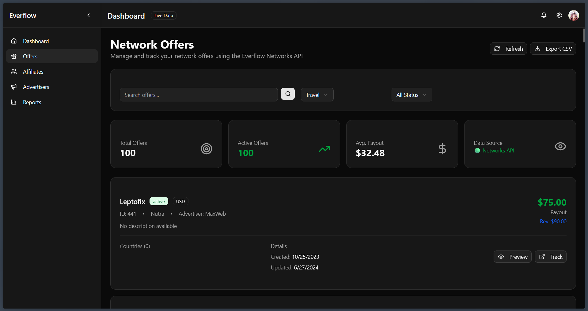
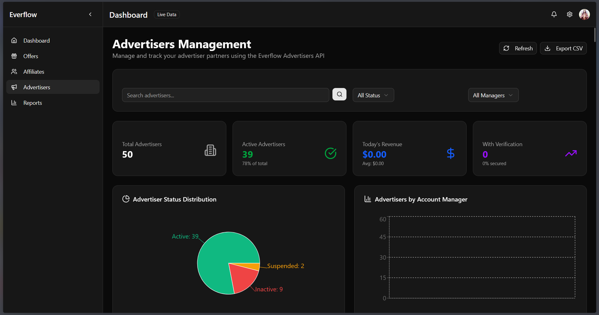
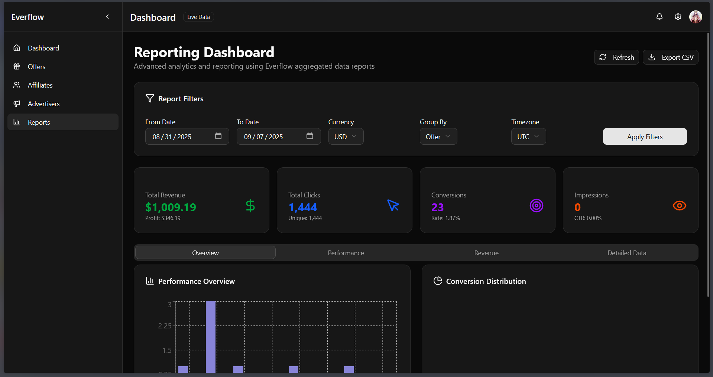
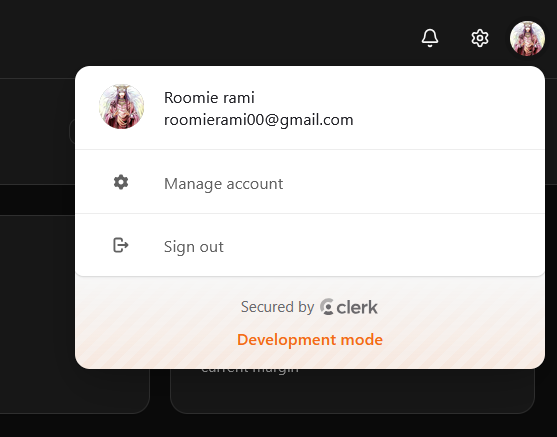

# 🚀 Everflow Dashboard

> A modern, comprehensive affiliate marketing dashboard built for **XenTraffic** to analyze and study the affiliate marketing landscape. This Next.js application provides deep insights into Everflow campaigns, affiliate performance, and market trends for strategic business intelligence.

[](https://nextjs.org/)
[](https://www.typescriptlang.org/)
[](https://tailwindcss.com/)
[](https://vercel.com/)

## 🎯 Project Purpose

This dashboard was specifically developed for **XenTraffic** to provide comprehensive market research capabilities in the affiliate marketing space. It enables detailed analysis of:

- **Market Trends** - Understanding affiliate marketing patterns and performance metrics
- **Competitor Analysis** - Studying market positioning and campaign strategies  
- **Performance Insights** - Deep-dive analytics for data-driven decision making
- **Business Intelligence** - Strategic insights for market expansion and optimization

## 📸 Screenshots



## 🔗 Live Demo

**[View Live Demo](https://everflow-dashboard-18lr.vercel.app/)** 

---

## 📋 Table of Contents

- [Features](#-features)
- [Tech Stack](#-tech-stack)
- [Why This Stack?](#-why-this-stack)
- [Getting Started](#-getting-started)
- [Environment Setup](#-environment-setup)
- [Project Structure](#-project-structure)
- [API Documentation](#-api-documentation)


## ✨ Features

### 📊 **Dashboard & Analytics**
- **Real-time KPI Monitoring** - Track revenue, conversions, affiliates, and offers
- **Interactive Charts** - Bar charts, pie charts, and line graphs for data visualization
- **Performance Metrics** - Comprehensive analytics with trend indicators
- **Date Range Filtering** - Customizable time periods for data analysis
- **Auto-refresh** - Real-time data updates with manual refresh capability

### 👥 **Affiliate Management**
- **Affiliate Directory** - Complete list with search and filtering capabilities
- **Performance Analytics** - Individual affiliate revenue tracking and statistics
- **Account Status Monitoring** - Track active, pending, and suspended affiliates
- **Payment Information** - Payment types, balances, and payout tracking
- **Activity Tracking** - Last login dates and account manager assignments

### 🎯 **Offer Management**
- **Offer Catalog** - Comprehensive offer listings with detailed information
- **Payout Tracking** - Monitor offer payouts and conversion rates
- **Performance Analysis** - Track offer success metrics and trends
- **Category Filtering** - Organize offers by vertical and campaign type
- **Status Management** - Monitor active, paused, and expired offers

### **Screenshot**


### 📈 **Advertiser Insights**
- **Advertiser Portfolio** - Complete advertiser directory and management
- **Campaign Performance** - Track advertiser campaign success rates
- **Revenue Analytics** - Monitor advertiser-specific revenue streams
- **Relationship Management** - Account manager and contact information

### **Screenshot**


### 📊 **Advanced Reporting**
- **Multi-dimensional Reports** - Analyze by offers, affiliates, advertisers, and time
- **Conversion Tracking** - Detailed conversion analysis with rates and trends
- **Revenue Analysis** - Profit margins, payouts, and gross sales reporting
- **Traffic Analytics** - Click tracking, impressions, and traffic source analysis
- **Export Capabilities** - CSV export for external analysis and reporting

### **Screenshot**


### 🔐 **Authentication & Security**
- **Clerk Integration** - Secure user authentication and session management
- **Role-based Access** - Protected routes and user permission management
- **API Security** - Secure API endpoints with authentication headers

### **Screenshot**


### 🛠️ **User Experience**
- **Responsive Design** - Optimized for desktop, tablet, and mobile devices
- **Intuitive Navigation** - Clean sidebar navigation with collapsible menu
- **Loading States** - Skeleton loading for better user experience
- **Error Handling** - Comprehensive error messages and fallback states

### 🔧 **Technical Features**
- **API Testing** - Built-in API testing interface for development
- **Real-time Updates** - Live data synchronization with Everflow API
- **Data Caching** - Optimized performance with intelligent data caching
- **Settings Management** - Customizable dashboard preferences and configurations

---

## 🛠️ Tech Stack

### **Frontend**
- **[Next.js 15.5.2](https://nextjs.org/)** - React framework with App Router for modern web applications
- **[React 19.1.0](https://reactjs.org/)** - Latest React with concurrent features and improved performance
- **[TypeScript 5.9.2](https://www.typescriptlang.org/)** - Type-safe development with enhanced developer experience
- **[Tailwind CSS 4.1.13](https://tailwindcss.com/)** - Utility-first CSS framework for rapid UI development
- **[Radix UI](https://www.radix-ui.com/)** - Headless UI components for accessibility and customization
- **[Lucide React](https://lucide.dev/)** - Beautiful & consistent icon library
- **[Recharts](https://recharts.org/)** - Composable charting library for React
- **[Zustand](https://github.com/pmndrs/zustand)** - Lightweight state management solution

### **Backend & APIs**
- **[Next.js API Routes](https://nextjs.org/docs/app/building-your-application/routing/route-handlers)** - Server-side API endpoints with TypeScript
- **[Everflow API](https://developers.everflow.io/)** - Primary data source for affiliate marketing metrics
- **REST API Integration** - RESTful endpoints for data fetching and management
- **Server-Side Rendering (SSR)** - Optimized performance with Next.js SSR capabilities
- **API Middleware** - Custom middleware for request handling and data processing

### **Authentication & Security**
- **[Clerk](https://clerk.dev/)** - Complete user management and authentication solution
- **JWT Tokens** - Secure token-based authentication
- **Protected Routes** - Route-level authentication and authorization
- **Session Management** - Secure user session handling and persistence
- **API Security** - Secured API endpoints with authentication headers

### **Development & Deployment**
- **[Vercel](https://vercel.com/)** - Cloud platform for static sites and serverless functions
- **[pnpm](https://pnpm.io/)** - Fast, disk space efficient package manager
- **[ESLint](https://eslint.org/)** - Code linting and quality assurance
- **[Turbopack](https://turbo.build/pack)** - Ultra-fast bundler for Next.js development
- **GitHub Actions** - Continuous integration and deployment pipeline

### **Utilities & Tools**
- **[date-fns](https://date-fns.org/)** - Modern JavaScript date utility library
- **[clsx](https://github.com/lukeed/clsx)** - Utility for constructing className strings
- **Class Variance Authority** - Type-safe component variant management
- **Tailwind Merge** - Utility for merging Tailwind CSS classes

---

## 🤔 Why This Stack?

### **Personal Expertise & Comfort**
This technology stack was chosen based on my personal expertise and comfort level with these tools. I have extensive experience working with React and Next.js, which allows me to build efficiently and deliver high-quality results for XenTraffic's market research needs.

### **Open Source Philosophy** 
I'm passionate about open source software and believe in its power to drive innovation. This entire stack is built on open source technologies:
- **React & Next.js** - Open source frameworks with massive community support
- **TypeScript** - Open source language that enhances JavaScript development
- **Tailwind CSS** - Open source utility-first CSS framework
- **All supporting libraries** - Community-driven, well-maintained open source projects

### **Project Requirements**
The technology choices were also guided by specific project requirements:
- **React** - Specifically requested by XenTraffic for frontend development
- **Everflow API** - Required data source as specified by the client
- **Modern Performance** - Next.js provides excellent performance for data-heavy dashboards
- **Rapid Development** - Familiar tools enable faster iteration and feature delivery

### **Technical Benefits**
- **Type Safety** - TypeScript provides excellent developer experience and reduces bugs
- **Performance** - Next.js App Router and SSR capabilities ensure fast loading times
- **Maintainability** - Well-structured, modern codebase that's easy to maintain and extend
- **Scalability** - Architecture supports future growth and additional features
- **Developer Experience** - Excellent tooling, hot reload, and debugging capabilities

### **Community & Support**
All chosen technologies have:
- **Large, active communities** for troubleshooting and learning
- **Excellent documentation** and learning resources
- **Regular updates** and long-term support
- **Proven track record** in production environments

---

## 🚀 Getting Started

### **Prerequisites**
Before you begin, ensure you have the following installed on your local machine:

- **[Node.js](https://nodejs.org/)** (v18.17 or higher)
- **[pnpm](https://pnpm.io/)** (recommended) or npm/yarn
- **[Git](https://git-scm.com/)**
- **Everflow API Access** - You'll need API credentials from Everflow
- **Clerk Account** - For authentication setup

### **Installation**

1. **Clone the repository**
   ```bash
   git clone https://github.com/RamiMohamed12/everflow-dashboard.git
   cd everflow-dashboard
   ```

2. **Install dependencies**
   ```bash
   # Using pnpm (recommended)
   pnpm install
   
   # Or using npm
   npm install
   
   # Or using yarn
   yarn install
   ```

3. **Environment Setup**
   
   Create a `.env.local` file in the root directory and add your environment variables:
   ```bash
   cp .env.example .env.local
   ```
   
   **Required Environment Variables:**
   ```env
   # Everflow API Configuration
   EF_API_KEY=your_everflow_api_key_here
   EF_API_URL=https://api.eflow.team/v1/networks/
   EF_URL_AFFILIATE=https://api.eflow.team/v1/affiliates/
   
   # Clerk Authentication
   NEXT_PUBLIC_CLERK_PUBLISHABLE_KEY=your_clerk_publishable_key
   CLERK_SECRET_KEY=your_clerk_secret_key
   ```

4. **Start the development server**
   ```bash
   # Using pnpm
   pnpm dev
   
   # Or using npm
   npm run dev
   
   # Or using yarn
   yarn dev
   ```

5. **Open your browser**
   
   Navigate to [http://localhost:3000](http://localhost:3000) to view the application.

### **Available Scripts**

- **`pnpm dev`** - Start development server with Turbopack
- **`pnpm build`** - Build the application for production
- **`pnpm start`** - Start the production server
- **`pnpm lint`** - Run ESLint for code quality checks

### **Development Workflow**

1. **Hot Reload** - Changes are automatically reflected in the browser
2. **Type Checking** - TypeScript provides real-time error checking
3. **Linting** - ESLint ensures code quality and consistency
4. **Fast Refresh** - React Fast Refresh preserves component state during edits

---

## 🔧 Environment Setup

### **Getting Everflow API Credentials**

1. **Sign up** for an Everflow account at [everflow.io](https://www.everflow.io/)
2. **Navigate** to Settings → API in your Everflow dashboard
3. **Generate** a new API key with appropriate permissions
4. **Copy** the API key and add it to your `.env.local` file

### **Setting up Clerk Authentication**

1. **Create** a Clerk account at [clerk.dev](https://clerk.dev/)
2. **Create** a new application in your Clerk dashboard
3. **Copy** your publishable key and secret key
4. **Configure** sign-in/sign-up options in Clerk dashboard
5. **Add** the keys to your `.env.local` file

### **Environment Variables Explained**

| Variable | Description | Required |
|----------|-------------|----------|
| `EF_API_KEY` | Your Everflow API key for data access | ✅ Yes |
| `EF_API_URL` | Base URL for Everflow API endpoints | ✅ Yes |
| `EF_URL_AFFILIATE` | Specific URL for affiliate endpoints | ✅ Yes |
| `NEXT_PUBLIC_CLERK_PUBLISHABLE_KEY` | Clerk publishable key (client-side) | ✅ Yes |
| `CLERK_SECRET_KEY` | Clerk secret key (server-side) | ✅ Yes |

### **Troubleshooting**

**Common Issues:**

1. **API Connection Errors**
   - Verify your Everflow API key is correct
   - Check that your API key has proper permissions
   - Ensure the API URLs are correctly formatted

2. **Authentication Issues**
   - Verify Clerk keys are properly set in environment variables
   - Check that your Clerk application is properly configured
   - Ensure you're using the correct Clerk domain

3. **Build Errors**
   - Run `pnpm install` to ensure all dependencies are installed
   - Check for TypeScript errors with proper type definitions
   - Verify Node.js version compatibility (v18.17+)

4. **Development Server Issues**
   - Clear `.next` folder: `rm -rf .next` (or `rmdir /s .next` on Windows)
   - Clear node_modules and reinstall: `rm -rf node_modules && pnpm install`
   - Check port availability (default: 3000)

**Need Help?**
- Check the [Next.js Documentation](https://nextjs.org/docs)
- Review [Clerk Documentation](https://clerk.dev/docs)
- Consult [Everflow API Documentation](https://developers.everflow.io/)

---

## 📁 Project Structure

The project follows Next.js 15 App Router conventions with a clean, organized structure:

```
everflow-dashboard/
├── 📁 public/                          # Static assets
│   ├── file.svg
│   ├── globe.svg
│   └── *.svg                          # Icon assets
│
├── 📁 src/                            # Source code
│   ├── 📁 app/                        # Next.js App Router
│   │   ├── layout.tsx                 # Root layout with Clerk provider
│   │   ├── page.tsx                   # Dashboard homepage
│   │   ├── globals.css                # Global styles
│   │   │
│   │   ├── 📁 api/                    # API Routes (Backend)
│   │   │   ├── 📁 everflow/           # Everflow API integrations
│   │   │   │   ├── 📁 affiliates/     # Affiliate endpoints
│   │   │   │   ├── 📁 offers/         # Offer endpoints
│   │   │   │   ├── 📁 advertisers/    # Advertiser endpoints
│   │   │   │   ├── 📁 reporting/      # Analytics endpoints
│   │   │   │   ├── 📁 traffic/        # Traffic analytics
│   │   │   │   └── 📁 dashboard-summary/ # KPI endpoints
│   │   │   └── 📁 dashboard/          # Internal API routes
│   │   │
│   │   ├── 📁 affiliates/             # Affiliate management pages
│   │   ├── 📁 offers/                 # Offer management pages
│   │   ├── 📁 advertisers/            # Advertiser pages
│   │   ├── 📁 reports/                # Analytics & reporting
│   │   ├── 📁 traffic/                # Traffic analytics
│   │   ├── 📁 deals/                  # Deal management
│   │   ├── 📁 coupon-codes/           # Coupon tracking
│   │   ├── 📁 settings/               # User preferences
│   │   ├── 📁 sign-in/[[...sign-in]]/ # Clerk authentication
│   │   └── 📁 sign-up/[[...sign-up]]/ # Clerk registration
│   │
│   ├── 📁 components/                 # Reusable React components
│   │   ├── sidebar.tsx                # Navigation sidebar
│   │   ├── top-bar.tsx                # Header component
│   │   ├── kpi-cards.tsx              # Dashboard KPI cards
│   │   ├── charts.tsx                 # Data visualization
│   │   ├── data-table.tsx             # Reusable data tables
│   │   ├── header-controls.tsx        # Action controls
│   │   └── 📁 ui/                     # Radix UI components
│   │       ├── button.tsx             # Custom button component
│   │       ├── card.tsx               # Card component
│   │       ├── input.tsx              # Form inputs
│   │       ├── select.tsx             # Dropdown selects
│   │       └── *.tsx                  # Other UI primitives
│   │
│   ├── 📁 hooks/                      # Custom React hooks
│   │   ├── useEverflowData.ts         # Main dashboard data
│   │   ├── useAffiliateOffersData.ts  # Affiliate offers hook
│   │   ├── useReportingData.ts        # Reporting analytics
│   │   ├── useTrafficData.ts          # Traffic analytics
│   │   └── useOffersData.ts           # Offers management
│   │
│   ├── 📁 lib/                        # Utility libraries
│   │   ├── everflow-api.ts            # Everflow API client
│   │   ├── utils.ts                   # Helper utilities
│   │   ├── type.ts                    # TypeScript definitions
│   │   └── mock-data.ts               # Development mock data
│   │
│   └── middleware.ts                  # Clerk authentication middleware
│
├── 📄 Configuration Files
├── .env.local                         # Environment variables
├── next.config.ts                     # Next.js configuration
├── tailwind.config.js                 # Tailwind CSS config
├── tsconfig.json                      # TypeScript configuration
├── eslint.config.mjs                  # ESLint configuration
├── package.json                       # Dependencies & scripts
└── components.json                    # Radix UI configuration
```

### **Architecture Highlights**

- **🏗️ App Router Structure** - Uses Next.js 15 App Router for file-based routing
- **🔄 API Layer** - RESTful API routes under `/api/everflow/` for data management
- **🎨 Component Library** - Radix UI components with Tailwind CSS styling
- **📊 Custom Hooks** - React hooks for data fetching and state management
- **🔒 Authentication** - Clerk middleware for route protection
- **📱 Responsive Design** - Mobile-first approach with Tailwind utilities

---

## 📚 API Documentation

The dashboard provides a RESTful API layer that interfaces with Everflow's API. All endpoints are secured with authentication and include comprehensive error handling.

### **Base URL**
```
https://your-domain.com/api/everflow/
```

### **Authentication**
All API requests require authentication via Clerk. Include the session token in your requests.

### **API Endpoints**

| Endpoint | Method | Description | Response |
|----------|--------|-------------|----------|
| `/api/everflow/affiliates` | GET | Fetch all affiliates | Affiliate list with analytics |
| `/api/everflow/offers` | GET | Fetch all offers | Offer catalog with performance data |
| `/api/everflow/advertisers` | GET | Fetch all advertisers | Advertiser directory |
| `/api/everflow/reporting` | GET | Analytics & reporting data | Comprehensive metrics |
| `/api/everflow/traffic` | GET | Traffic analytics | Click & conversion data |
| `/api/everflow/dashboard-summary` | GET | Dashboard KPI data | Summary statistics |

### **Example API Usage**

**Fetching Affiliates:**
```typescript
// API Route Implementation
import { auth } from "@clerk/nextjs/server";
import { NextResponse } from "next/server";
import { everflowRequest } from "@/lib/everflow-api";

export async function GET(request: Request) {
  try {
    // Authenticate user with Clerk
    const { userId } = await auth();
    if (!userId) {
      return NextResponse.json({ error: "Unauthorized" }, { status: 401 });
    }

    // Parse query parameters
    const { searchParams } = new URL(request.url);
    const page = searchParams.get('page') || '1';
    const pageSize = searchParams.get('page_size') || '50';
    
    // Make request to Everflow API
    const affiliatesData = await everflowRequest(
      `/affiliates?page=${page}&page_size=${pageSize}`,
      'GET'
    );

    // Return structured response
    return NextResponse.json({
      success: true,
      data: affiliatesData.affiliates || [],
      paging: affiliatesData.paging,
      timestamp: new Date().toISOString()
    });

  } catch (error) {
    console.error('Error fetching affiliates:', error);
    return NextResponse.json(
      { error: "Failed to fetch affiliates" },
      { status: 500 }
    );
  }
}
```

**Frontend Data Fetching:**
```typescript
// Custom Hook Usage
import { useEverflowData } from '@/hooks/useEverflowData';

const Dashboard = () => {
  const {
    dashboardSummary,
    affiliates,
    offers,
    loading,
    error,
    refreshData
  } = useEverflowData();

  // Data is automatically managed with loading states
  if (loading) return <LoadingSkeleton />;
  if (error) return <ErrorMessage error={error} />;

  return (
    <div>
      <KPICards data={dashboardSummary} />
      <Charts data={affiliates} />
    </div>
  );
};
```

### **Error Handling**
All APIs include comprehensive error handling with informative error messages:

```json
{
  "error": "Validation failed",
  "details": "Invalid date range provided",
  "timestamp": "2025-01-20T10:30:00Z",
  "status": 400
}
```

### **Rate Limiting**
API endpoints implement rate limiting to ensure optimal performance and prevent abuse.

